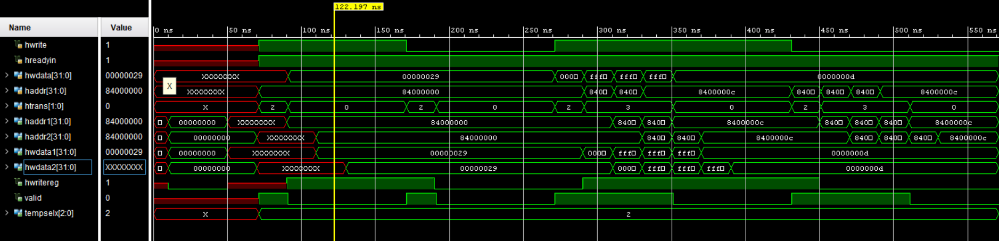
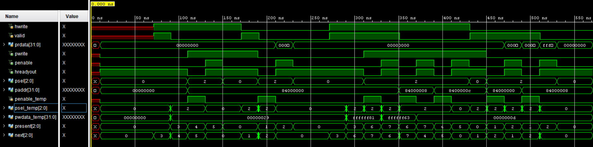

# AHB to APB Bridge — AMBA Protocol RTL Implementation


A fully synthesizable RTL implementation of an AMBA AHB-to-APB 
bridge in Verilog. Designed to interface a high-bandwidth AHB 
master with low-power APB peripherals.

> Files and documentation being added progressively.


---

## The Problem

Modern SoCs use multiple bus standards simultaneously. The CPU 
runs on AHB — fast, pipelined, high bandwidth. Peripherals like 
UART, GPIO, and SPI run on APB — simple, low-power, two-cycle 
handshake. They cannot communicate directly. This bridge 
translates between them.

---

## AHB Slave Interface (`ahb_slave_interface.v`)

AHB is pipelined — the address of transfer N arrives one clock 
cycle before the data of transfer N. APB needs both simultaneously.

This module resolves the mismatch using a 2-stage pipeline:

haddr  ──► [haddr1]  ──► [haddr2]  ──► APB

hwdata ──► [hwdata1] ──► [hwdata2] ──► APB

hwrite ──► [hwritereg] ──► [hwritereg1] ──► APB


Also generates:
- `valid` — confirms a real transfer is occurring
- `tempselx` — one-hot peripheral select decoded from address

### Address Map

| Slave | Address Range | `tempselx` |
|---|---|---|
| Slave 1 | `0x8000_0000` – `0x83FF_FFFF` | `3'b001` |
| Slave 2 | `0x8400_0000` – `0x87FF_FFFF` | `3'b010` |
| Slave 3 | `0x8800_0000` – `0x8BFF_FFFF` | `3'b100` |


---

## APB Controller (`apb_controller.v`)

An 8-state Mealy FSM that drives the APB two-phase handshake:

- **SETUP phase**: `psel=1`, `penable=0`
- **ENABLE phase**: `psel=1`, `penable=1` ← transfer happens here

Also drives `hreadyout` low to stall the AHB master while 
the slower APB transfer completes.

### FSM States

| State | Encoding | Description |
|---|---|---|
| `idle` | 000 | Waiting for valid transfer |
| `read` | 001 | APB setup cycle for read |
| `renable` | 010 | APB enable cycle for read |
| `wwait` | 011 | Capture write address and data |
| `write` | 100 | APB setup cycle for write |
| `wenable` | 101 | APB enable cycle for write |
| `writep` | 110 | Pipelined write setup (burst) |
| `wenablep` | 111 | Pipelined write enable (burst) |


---

## APB Interface (`apb_interface.v`)

Drives the final APB output signals to the peripheral and 
generates read data for simulation. When a read transfer is 
active (pwrite=0, penable=1, psel active), it returns a 
random value simulating a peripheral response.

| Signal | Direction | Description |
|---|---|---|
| `pwrite` | input | Write control from controller |
| `penable` | input | Enable signal from controller |
| `psel` | input | Peripheral select from controller |
| `paddr` | input | Address to peripheral |
| `pwdata` | input | Write data to peripheral |
| `prdata` | output | Read data returned to bridge |


---

## Bridge Top (`bridge_top.v`)

Top-level wrapper that connects the AHB Slave Interface and 
APB Controller together. All internal wires between the two 
sub-modules are declared here.

```
AHB Master
    │
    ▼
ahb_slave_interface (A1)
    │
    │  haddr1/2, hwdata1/2, hwritereg, valid, tempselx
    ▼
apb_controller (A2)
    │
    ▼
APB Peripherals
```


---

## AHB Master (`ahb_master.v`)

Behavioral model of an AHB master used for simulation only. 
Not synthesizable. Implements four tasks:

| Task | Description |
|---|---|
| `single_write` | Single beat write to address 0x8400_0000 |
| `single_read` | Single beat read from address 0x8400_0000 |
| `burst_incr4_write` | 4-beat incrementing burst write |
| `burst_incr4_read` | 4-beat incrementing burst read |


---

## Testbench (`top_tb.v`)

Instantiates all modules and runs four test scenarios 
sequentially:

| Test | Description |
|---|---|
| `single_write` | Writes 0x29 to address 0x8400_0000 |
| `single_read` | Reads from address 0x8400_0000 |
| `burst_incr4_write` | 4-beat burst write starting at 0x8400_0000 |
| `burst_incr4_read` | 4-beat burst read starting at 0x8400_0000 |

Clock period: 20ns. Reset applied for 2 cycles before each test.


---

## Simulation Waveforms

### AHB Slave Interface



Shows the 2-stage pipeline in action. `haddr1` and `haddr2` each 
lag `haddr` by one clock cycle, and `hwdata1`/`hwdata2` lag 
`hwdata` the same way — by the second stage, address and data 
from the same transaction line up. `valid` pulses high whenever 
`htrans` is `2` (NONSEQ) or `3` (SEQ) and drops to `0` during 
`htrans = 0` (IDLE) gaps between transfers. `tempselx` reads `2` 
(`3'b010`), confirming Slave 2 selection for the `0x84xx_xxxx` 
address range. The waveform covers all four test cases run back 
to back: single write, single read, burst write, and burst read.


### APB Controller



The `present` signal traces the FSM through all four tests. The 
single write runs `idle(0) → wwait(3) → write(4) → wenable(5) → 
idle(0)`. The single read runs `idle(0) → read(1) → renable(2) → 
idle(0)`. The burst write enters the pipelined path — 
`wwait(3) → writep(6) → wenablep(7) → writep(6) → wenablep(7) → 
write(4) → wenable(5)` — using the `writep`/`wenablep` states to 
overlap consecutive beats. The burst read loops 
`read(1) → renable(2)` for each beat.

`psel` holds `2` (Slave 2) whenever a transfer is active and 
returns to `0` in `idle`, matching the `0x84xx_xxxx` address 
range. `penable` pulses high for one cycle per beat — the APB 
ENABLE phase — while `hreadyout` drops low during setup states, 
stalling the AHB master until the APB side completes. `paddr` 
tracks `haddr1` rather than `haddr` directly, so it reflects the 
pipelined address one stage behind the master.


